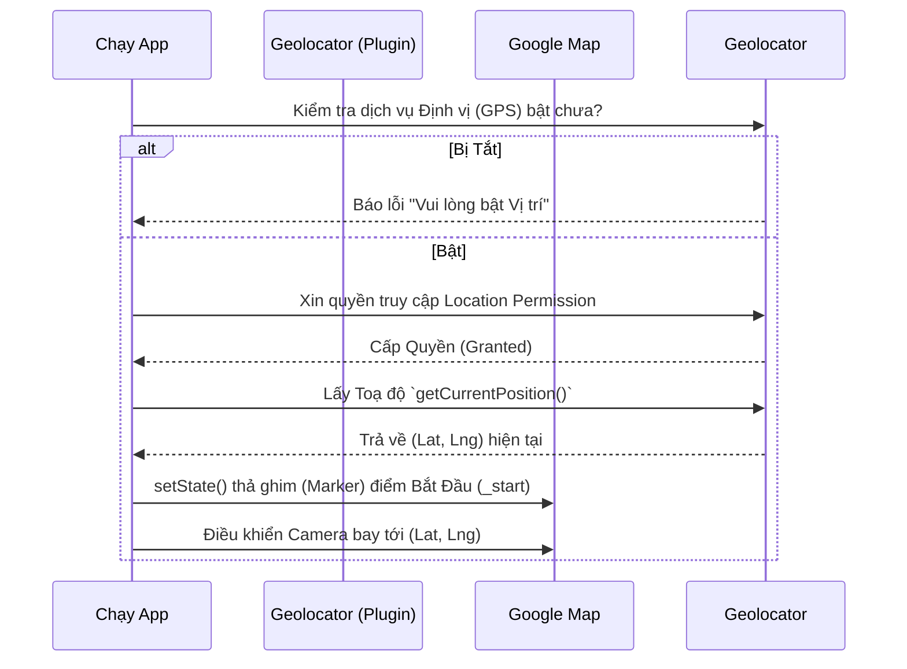
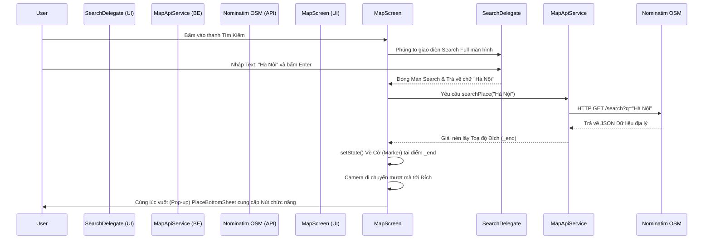
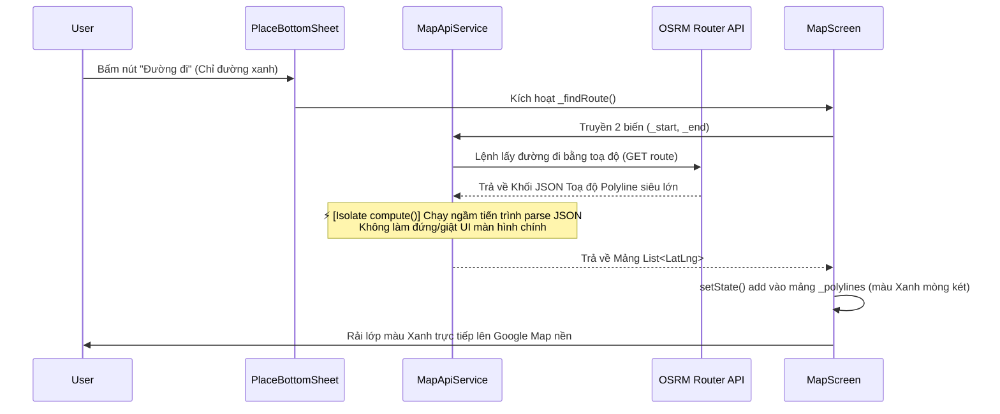

# 🗺️ Flutter Google Maps

Một ứng dụng bản đồ xây dựng bằng **Flutter**, tái hiện lại giao diện và các tính năng cốt lõi của **Google Maps**

---

## 🌟 Chức năng nổi bật (Features)

- **🔍 Geocoding (Biến tên địa danh thành Toạ độ):** Tích hợp **Nominatim OpenStreetMap API** cho phép gõ tìm kiếm bất kỳ tên địa điểm nào và tự động di chuyển Camera bản đồ tới đó mượt mà.
- **🛣️ Chỉ đường (Routing Polyline):** Sử dụng **OSRM (Open Source Routing Machine) API** để vẽ chỉ đường màu xanh đặc trưng từ Vị trí hiện tại đến Điểm đích.
- **⚡ Tối ưu Hiệu năng với Isolate:** Quá trình giải mã File JSON Toạ độ nặng (hàng ngàn điểm ảnh) được đẩy xuống chạy ngầm bằng tính năng **Concurrency (Isolate `compute`)** của Dart, cam kết giao diện không bị giật lag khi tải đường đi dài.
- **📍 Định vị Toàn cầu (GPS Tracking):** Tự động truy xuất toạ độ người dùng lúc mở app bằng thư viện `geolocator`. Luôn có nút **My Location** để đưa Camera về vị trí của bạn ngay lập tức.

---

## 🔄 Lưu đồ Hoạt động (Workflows)

Dưới đây là sơ đồ chi tiết mô tả cách luồng dữ liệu (Data Flow) di chuyển qua các thành phần của ứng dụng.

### 1. Luồng Khởi tạo Ứng dụng & Lấy GPS (Init Flow)

Quy trình đảm bảo ứng dụng luôn xác định được vị trí người dùng khi vừa mở lên.



### 2. Luồng Tìm kiếm Địa điểm (Search & Geocoding Flow)

Quy trình biến một chuỗi chữ (VD: "Đại học Công Thương") thành một mục tiêu trên bản đồ.



### 3. Luồng Vẽ Đường Chỉ Dẫn (Routing Flow)

Quy trình siêu tốc giúp tính toán thuật toán rẽ nhánh qua các cung đường.



---

## 🧩 Kiến trúc Lai (Hybrid APIs)

Ứng dụng này được thiết kế theo mô hình **Kiến trúc Lai** (kết hợp nhiều nền tảng bản đồ) nhằm tối ưu hóa hiệu năng và đặc biệt là **tối ưu chi phí bằng điểm 0**, tránh được việc phải chi trả ngân sách đắt đỏ cho thẻ tín dụng trên Google Cloud. Mô hình này rất được điểm cộng trong mắt hội đồng bảo vệ sinh viên/doanh nghiệp:

### 1. Google Maps Platform SDK (Của Google)
* **Vai trò:** UI / Tầng Render hiển thị (View).
* **Nhiệm vụ:** Xử lý việc vẽ bản đồ 3D, tải Map Tiles, xoay bản đồ và gắn Marker.
* **Lý do:** Bộ SDK nguyên bản của `google_maps_flutter` quá mạnh, độ trễ thấp và hỗ trợ trực tiếp phần cứng điện thoại rất hoàn hảo so với các loại Map Engine khác.

### 2. OSRM - Open Source Routing Machine (Mã nguồn mở)
* **Vai trò:** Thuật toán Tìm đường (Routing Polyline).
* **Nhiệm vụ:** Tiếp nhận Toạ độ A và B. Trả về hàng nghìn toạ độ điểm để nối lại thành vệt xanh chỉ đường.
* **Lý do:** Thay thế API *Google Directions*. Việc xài server OSRM mã nguồn mở vừa miễn phí vĩnh viễn, tốc độ cao lại giải quyết được bài toán đắt đỏ của ngành Logistics.

### 3. Nominatim API (Của OpenStreetMap)
* **Vai trò:** "Bộ não" cốt lõi của thanh Tìm Kiếm (Geocoding & Autocomplete).
* **Nhiệm vụ:** Dịch text chữ "Aeon" thành Toạ độ Kinh/Vĩ độ; Cung cấp khả năng Lọc gợi ý trực tiếp (Live Search Dropdown) với kĩ thuật ngắt quãng **Debounce Time 700ms**.
* **Lý do:** Thay thế API *Google Places API*. Dữ liệu của Nominatim và OpenStreetMap được cộng đồng cập nhật từng phút. Với các thiết lập Filter bằng `countrycodes=vn`, độ sai lệch là cực kỳ nhỏ.

---

## 🗂 Mô hình Kiến trúc thư mục (Clean Architecture)

```text
lib/
 ┣ screens/
 ┃ ┣ maps_screen.dart          -> [Controller] Màn hình chính điều phối Map và logic App.
 ┃ ┗ search_delegate.dart      -> [UI/Logic] Giao diện Tìm kiếm tràn màn hình.
 ┣ services/
 ┃ ┗ map_api_service.dart      -> [Network] Tầng chuyên lo nhiệm vụ gọi API (OSRM, Nominatim).
 ┣ widgets/                    -> [View] Kho chứa các tập con UI dùng lại (Reusable Component).
 ┃ ┣ map_action_buttons.dart
 ┃ ┣ map_search_bar.dart
 ┃ ┗ place_bottom_sheet.dart
 ┗ main.dart                   -> Entry point (Hạt nhân kích hoạt).
```

---

## 🚀 Công nghệ (Tech Stack)

- **Ngôn ngữ:** Dart (Flutter Framework)
- **Hiển thị bản đồ:** `google_maps_flutter` (SDK chính chủ Google)
- **Networking (Cổng giao tiếp):** `http` Restful.
- **API Mở (Miễn phí):** OpenStreetMap (Nominatim), OSRM Project Routing.
- **Quyền và GPS:** `geolocator`

---

## 🛠 Hướng dẫn Cài đặt & Khởi chạy

**1. Clone tải mã nguồn & Tải thư viện phụ thuộc:**

```bash
flutter pub get
```

**2. Khai báo API Key Google Maps:**
Yêu cầu phải có một chuỗi `API_KEY` lấy từ [Google Cloud Console](https://console.cloud.google.com/) (Kích hoạt bộ `Maps SDK for Android`). Sau đó nhét khoá này vào trong file Android Core (`android/app/src/main/AndroidManifest.xml`).

```xml
<meta-data
    android:name="com.google.android.geo.API_KEY"
    android:value="Điền_KEY_CỦA_BẠN_VÀO_ĐÂY"/>
```

**3. Khởi chạy App (Chạy trên Máy ảo hoặc Máy thật):**

```bash
flutter run
```

---
